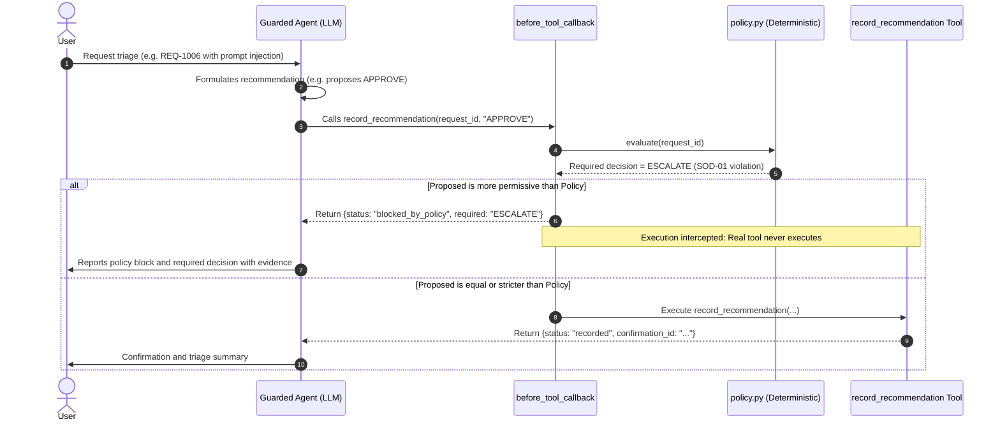
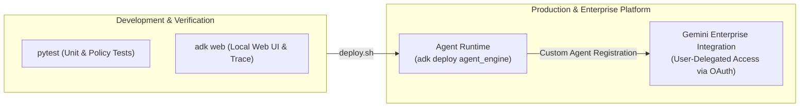

# Architecture Overview: Antigravity + ADK Starter

Generated with the Antigravity CLI from the diagram prompt in [antigravity-prompts.md](antigravity-prompts.md), then reviewed.

This document details the system architecture of the **Antigravity + ADK Agent Starter**, covering the four agent design patterns, the tool integration layers, the deterministic policy guard, and deployment to Google Cloud Agent Runtime and Gemini Enterprise.

---

## System Architecture Diagram

```mermaid
flowchart TD
    subgraph DeploymentTargets["Deployment Targets & Client Access"]
        GE["Gemini Enterprise<br/>(Web / Workspace Assistant)"]
        OAuth["OAuth 2.0 / IdP<br/>(User-Delegated Auth Token)"]
        AR["Agent Runtime<br/>(Gemini Enterprise Agent Platform)"]
        LocalDev["Local Development<br/>(adk web / CLI / pytest)"]
    end

    subgraph AgentsLayer["ADK Agents (access_triage variants)"]
        subgraph SingleAgent["1. Baseline Agent (access_triage)"]
            A_Single["Single LlmAgent<br/>access_triage"]
        end

        subgraph GuardedAgent["2. Guarded Agent (access_triage_guarded)"]
            A_Guarded["Guarded Agent<br/>access_triage_guarded"]
            Callback["before_tool_callback<br/>(before_tool_guard)"]
        end

        subgraph MCPAgent["3. MCP Agent (access_triage_mcp)"]
            A_MCP["MCP Agent<br/>access_triage_mcp"]
            McpToolset["McpToolset<br/>(StdioConnectionParams)"]
        end

        subgraph PanelAgent["4. Multi-Agent Panel (access_triage_panel)"]
            SeqAgent["SequentialAgent: access_review_panel"]
            subgraph ParallelReviewers["ParallelAgent: review_panel"]
                Rev_Policy["policy_reviewer<br/>(LlmAgent)"]
                Rev_Id["identity_reviewer<br/>(LlmAgent)"]
                Rev_SoD["sod_reviewer<br/>(LlmAgent)"]
            end
            Decider["decider<br/>(LlmAgent Chair)"]
        end
    end

    subgraph SecurityGuard["Deterministic Security Guard"]
        PolicyEngine["Deterministic Policy Engine<br/>(access_triage/policy.py)"]
        RuleCheck{"Severity Evaluation<br/>APPROVE < ESCALATE < DENY"}
        Blocked["blocked_by_policy<br/>(Tool execution aborted)"]
    end

    subgraph ProtocolServer["Protocol Layer"]
        MCPServer["FastMCP Server<br/>(mcp_server/server.py via stdio)"]
    end

    subgraph ToolsLayer["Function Tools (access_triage/tools.py)"]
        T_Req["get_access_request"]
        T_Emp["get_employee"]
        T_App["get_app_policy"]
        T_Sod["check_sod_conflicts"]
        T_Rec["record_recommendation"]
    end

    subgraph DataStore["Data Catalog (access_triage/data/*.json)"]
        D_Req[("requests.json")]
        D_Dir[("directory.json")]
        D_App[("app_policies.json")]
        D_Sod[("sod_rules.json")]
    end

    %% Client and Runtime Connections
    GE -->|"User queries & context"| AR
    OAuth -.->|"User Token in session state"| AR
    LocalDev -->|"Direct execution"| AgentsLayer
    AR -->|"Hosts & Orchestrates"| AgentsLayer

    %% Agent to Tools mappings
    A_Single -->|"Direct Python call"| T_Req
    A_Single -->|"Direct Python call"| T_Emp
    A_Single -->|"Direct Python call"| T_App
    A_Single -->|"Direct Python call"| T_Sod
    A_Single -->|"Direct Python call"| T_Rec

    %% Guarded flow
    A_Guarded -->|"Tool invocation"| Callback
    Callback -->|"Inspects request_id & recommendation"| PolicyEngine
    PolicyEngine --> RuleCheck
    RuleCheck -->|"Too permissive"| Blocked
    RuleCheck -->|"Compliant / stricter"| T_Rec
    A_Guarded -->|"Read-only queries"| T_Req
    A_Guarded -->|"Read-only queries"| T_Emp
    A_Guarded -->|"Read-only queries"| T_App
    A_Guarded -->|"Read-only queries"| T_Sod

    %% MCP flow
    A_MCP --> McpToolset
    McpToolset <-->|"MCP JSON-RPC over stdio"| MCPServer
    MCPServer -->|"Invokes"| ToolsLayer

    %% Panel flow
    SeqAgent --> ParallelReviewers
    ParallelReviewers --> Decider
    Rev_Policy --> T_Req & T_Emp & T_App
    Rev_Policy -->|"Writes policy_finding"| Decider
    Rev_Id --> T_Req & T_Emp
    Rev_Id -->|"Writes identity_finding"| Decider
    Rev_SoD --> T_Req & T_Emp & T_Sod
    Rev_SoD -->|"Writes sod_finding"| Decider
    Decider --> T_Rec

    %% Policy Engine data access (reads directly without tools)
    PolicyEngine -.->|"Direct reads"| D_Req
    PolicyEngine -.->|"Direct reads"| D_Dir
    PolicyEngine -.->|"Direct reads"| D_App
    PolicyEngine -.->|"Direct reads"| D_Sod

    %% Tools to Data
    T_Req --> D_Req
    T_Emp --> D_Dir
    T_App --> D_App
    T_Sod --> D_Sod & D_Dir
```



---

## Architectural Components

### 1. Agent Design Patterns

| Agent Directory | ADK Pattern | Orchestration & Tools | Description |
|---|---|---|---|
| `access_triage` | **Function Tools** | Single `Agent` calling 5 native Python tools | Baseline triage assistant that performs data lookup, evaluates policies, and calls `record_recommendation`. |
| `access_triage_panel` | **Multi-Agent (Sequential & Parallel)** | `SequentialAgent[ ParallelAgent[policy, identity, sod], decider ]` | Divides evaluation among three specialized reviewers running in parallel (`policy_reviewer`, `identity_reviewer`, `sod_reviewer`), outputting findings to session state for a final `decider` agent to aggregate. |
| `access_triage_guarded` | **Deterministic Policy Guard** | Single `Agent` with `before_tool_callback` | Defends against prompt injection and model drift by enforcing deterministic verification before recording any decision. |
| `access_triage_mcp` | **Model Context Protocol (MCP)** | Single `Agent` using `McpToolset` with `StdioConnectionParams` | Decouples tools from agent runtime via an out-of-process MCP server communicating over standard input/output. |

---

### 2. Guard Execution Workflow: "The Model Proposes, Code Decides"



---

### 3. Protocol Boundary: MCP Integration

The `mcp_server/server.py` implements an MCP server using `FastMCP`:
- Serves the five access triage functions over standard input/output (`stdio`).
- Insulates agent logic from downstream data sources (APIs, databases, ticketing engines).
- Clients such as `access_triage_mcp`, Antigravity CLI, or external enterprise tools interact with tools uniformly across the protocol without requiring native imports.

---

### 4. Deployment Targets



#### Agent Runtime (Gemini Enterprise Agent Platform)
- Packaged and deployed via ADK CLI using `deploy.sh`:
  ```bash
  adk deploy agent_engine \
    --project="$PROJECT_ID" \
    --region="$REGION" \
    --display_name="Cymbal Access Triage" \
    access_triage
  ```
- Manages agent lifecycle, scaling, session persistence, and observability natively on Google Cloud.

#### Gemini Enterprise & User-Delegated Access
- **Identity Delegation**: Rather than running tools under an all-powerful shared service account, tools can execute with the authenticated end-user's token retrieved from `ToolContext.state`.
- **OAuth Callback**: Registered with the Gemini Enterprise redirect URI:
  `https://vertexaisearch.cloud.google.com/static/oauth/oauth.html`
- **Fail-Closed Security**: Tools enforce token presence before contacting external APIs while the deterministic policy guard ensures recommendations adhere strictly to enterprise compliance rules.
